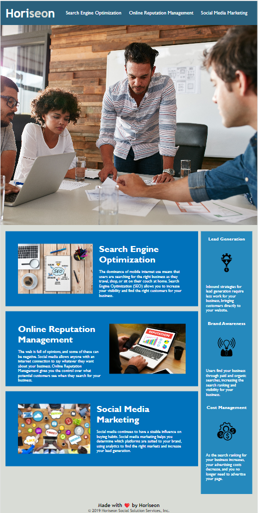

# Weekly Challenge Module 1
## Description
This repository contains the weeekly challenge module.The challenge consists of various acceptance criteria as mentioned below

GIVEN a webpage meets accessibility standards
WHEN I view the source code
THEN I find semantic HTML elements
WHEN I view the structure of the HTML elements
THEN I find that the elements follow a logical structure independent of styling and positioning
WHEN I view the image elements
THEN I find accessible alt attributes
WHEN I view the heading attributes
THEN they fall in sequential order
WHEN I view the title element
THEN I find a concise, descriptive title

Additionally added icon to the web title and added the navigation to top of the page.
## Usage
To use this module click following link : https://ekamjotsidhu.github.io/weekly-challenge/
The screenshot below shows the final webpage

## Credits
N/A
## License
N/A
